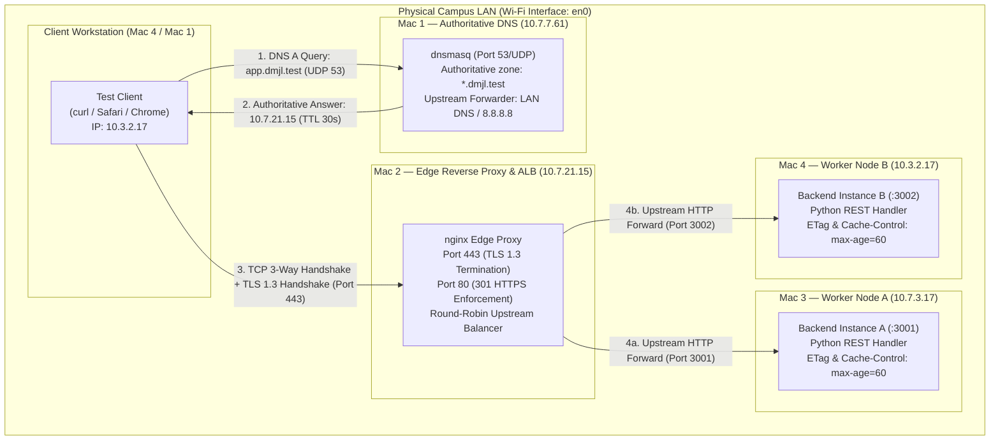
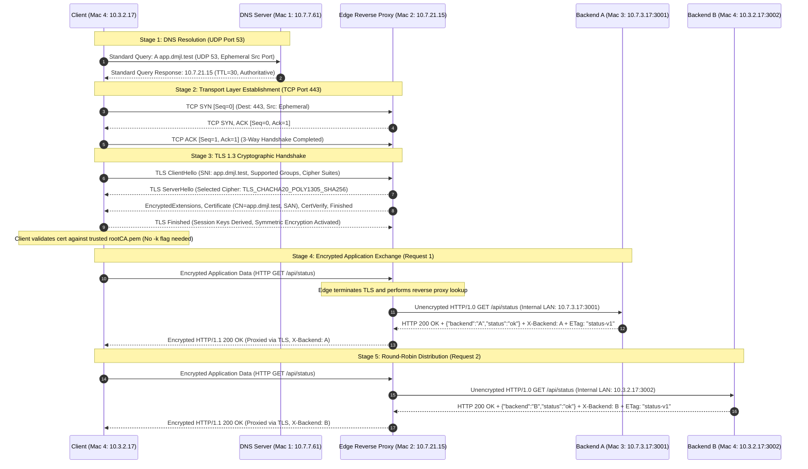

# Architecture Document — dmjl_port (Phase 1: Build & Observe)

> **Course:** Computer Networks Course Project  
> **Platform:** Private Network Service Platform  
> **Deployment Model:** 4 Physical macOS Laptops on Private LAN (Submission Type 1)  
> **Team:** Section C (Dhanvin Vadlamudi, Jagruthi Pulumati, Chaitanya Sai Meka, Kasula Lalithendra)  

---

## 1. Network Topology & Physical Node Inventory

The platform is deployed entirely on a private local area network (LAN) over physical Wi-Fi interfaces (`en0`) without relying on any external cloud infrastructure or public domain registries.

### Node Inventory & Role Specification

| Machine | Hostname / Node Name | Assigned Physical IP | Interface | Open Service Ports / Protocols | Primary Software Stack | Cloud Architecture Equivalent |
|---|---|---|---|---|---|---|
| **Mac 1** | `Dhanvin’s MacBook Pro` | `10.7.7.61` | `en0` | `53/UDP`, `53/TCP` | `dnsmasq` v2.90+ | AWS Route 53 Private Hosted Zone |
| **Mac 2** | `Jagruthi’s MacBook Pro` | `10.7.21.15` | `en0` | `443/TCP` (TLS), `80/TCP` (HTTP Redirect) | `nginx` v1.31+, OpenSSL 3.x | AWS Application Load Balancer (ALB) |
| **Mac 3** | `MacBook Pro` | `10.7.3.17` | `en0` | `3001/TCP` (HTTP) | Python 3 `http.server` (Node A) | Amazon EC2 Target Group Worker A |
| **Mac 4** | `kasula’s MacBook Pro` | `10.3.2.17` | `en0` | `3002/TCP` (HTTP) | Python 3 `http.server` (Node B) + Client Suite | Amazon EC2 Target Group Worker B + VPC Client |

- **Subnet Configuration:** Subnet masks `255.255.224.0` (`/19`) and `255.255.252.0` (`/22`), routed seamlessly via LAN default gateways (`10.7.0.1` / `10.3.0.1`).
- **Private Domain Namespace:** `app.dmjl.test` and `api.dmjl.test` (utilizing the RFC 2606 reserved `.test` Top-Level Domain to prevent leakage into public DNS and collision with macOS mDNS `.local`).

---

## 2. Network Topology Diagram

---

## 3. End-to-End Request Lifecycle & Protocol Flow

Every client transaction traverses the entire network stack across multiple physical machines. The detailed flow for a standard request (`curl https://app.dmjl.test/api/status`) is documented below:

---

## 4. Multi-Layer OSI & TCP/IP Protocol Stack Mapping

This architecture directly demonstrates every layer of the classical OSI reference model and TCP/IP protocol suite:

| Layer (TCP/IP) | OSI Model Equivalent | Protocol in This Implementation | Operational Behavior & Evidence |
|---|---|---|---|
| **Application** | Layer 7 | **DNS** (`RFC 1035`) | Authoritative resolution of `.test` domain via `dnsmasq` on port 53. Evidence: [`A3_dig_client.txt`](evidence/ev_mac4/A3_dig_client.txt), [`C1_dns.png`](evidence/ev_mac3/C1_dns.png). |
| **Application** | Layer 7 | **HTTP/1.1 & REST** (`RFC 7230-7235`) | JSON payload exchange, `X-Backend` header routing, `Cache-Control: max-age=60`, conditional `If-None-Match` revalidation (`304 Not Modified`). Evidence: [`B2_lb_6x.txt`](evidence/ev_mac4/B2_lb_6x.txt), [`D1_304.txt`](evidence/ev_mac4/D1_304.txt). |
| **Presentation** | Layer 6 | **TLS 1.3** (`RFC 8446`) | Edge TLS termination on Nginx. Session encryption, X.509 certificate validation, perfect forward secrecy (PFS). Evidence: [`B1_curl_v.txt`](evidence/ev_mac4/B1_curl_v.txt), [`C3_tls.png`](evidence/ev_mac3/C3_tls.png). |
| **Session** | Layer 5 | **Sockets & TLS Sessions** | Session setup, teardown, socket management across client, edge, and backend pools. |
| **Transport** | Layer 4 | **TCP** (`RFC 793`) & **UDP** (`RFC 768`) | UDP 53 for lightweight DNS lookups; reliable connection-oriented TCP (SYN/SYN-ACK/ACK) on port 443, 3001, 3002. Evidence: [`C2_tcp.png`](evidence/ev_mac3/C2_tcp.png). |
| **Network** | Layer 3 | **IPv4 & ICMP** (`RFC 791, 792`) | Subnet addressing, packet routing across `10.7.x.x` and `10.3.x.x`, ICMP reachability verification with 0% loss. Evidence: [`A5_pings_mac1.txt`](evidence/ev_mac1/A5_pings_mac1.txt). |
| **Data Link** | Layer 2 | **IEEE 802.11 / Ethernet** | MAC addressing (`ether` hardware frames) over Wi-Fi interface `en0`. Evidence: [`A1_mac1.txt`](evidence/ev_mac1/A1_mac1.txt) - [`A1_mac4.txt`](evidence/ev_mac4/A1_mac4.txt). |
| **Physical** | Layer 1 | **Radio Frequency / Wi-Fi** | Physical 802.11 wireless medium connecting all 4 Apple silicon laptops. |

---

## 5. Port Identification & Socket Pair Mapping

Every active transaction is uniquely identified by a 5-tuple socket pair `(Source IP, Source Port, Destination IP, Destination Port, Protocol)`:

1. **DNS Transaction:**
   - **Source Socket:** `10.3.2.17 : <ephemeral-udp-port>` (Client)
   - **Destination Socket:** `10.7.7.61 : 53` (Well-known DNS UDP service port on Mac 1)
2. **Client to Edge Ingress:**
   - **Source Socket:** `10.3.2.17 : <ephemeral-tcp-port>` (Client)
   - **Destination Socket:** `10.7.21.15 : 443` (Well-known HTTPS TCP port on Mac 2)
3. **Edge to Backend A Egress:**
   - **Source Socket:** `10.7.21.15 : <ephemeral-tcp-port>` (Nginx upstream worker)
   - **Destination Socket:** `10.7.3.17 : 3001` (Fixed TCP service port on Mac 3)
4. **Edge to Backend B Egress:**
   - **Source Socket:** `10.7.21.15 : <ephemeral-tcp-port>` (Nginx upstream worker)
   - **Destination Socket:** `10.3.2.17 : 3002` (Fixed TCP service port on Mac 4)

---

## 6. TLS Offloading & Edge Security Architecture

In modern cloud production systems, CPU-intensive cryptographic handshakes and public certificate management are centralized at the application load balancer (ALB), while backend microservices communicate over high-throughput, low-latency private networks.

Our system implements this exact architecture:
- **Public / Client Boundary:** Port 443 with TLS 1.3 encryption, protecting sensitive payloads over the air.
- **Private Backend Boundary:** Ports 3001 & 3002 with unencrypted HTTP/1.0, verified live via packet analysis ([`C_bonus_http.png`](evidence/ev_mac3/C_bonus_http.png)).
