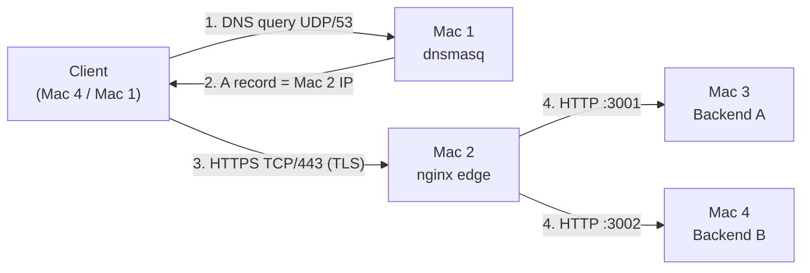
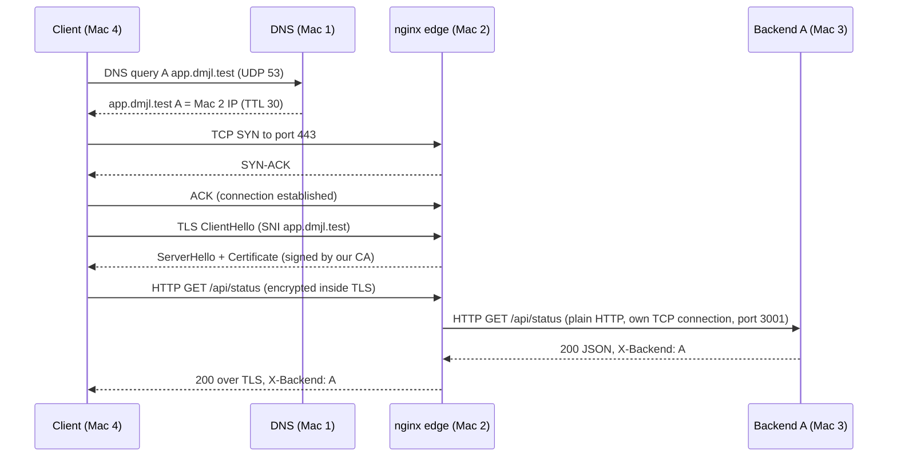

# dmjl_port — Computer Networks Project (Phase 1: Build & Observe)

Private network service platform on **4 MacBook Pros on one LAN** (Submission Type 1).
A client resolves `app.dmjl.test` through our own DNS server, connects over HTTPS to an
nginx edge that terminates TLS, and is load-balanced across two REST backends.

> The application stays simple — the network is the project.

## Team · Section C

| Enrollment | Name | Machine | Role |
|---|---|---|---|
| <ENROLLMENT> | Dhanvin Vadlamudi | Mac 1 | Private DNS server (dnsmasq) + test client, GitHub repo |
| <ENROLLMENT> | Jagruthi <SURNAME> | Mac 2 | Edge: nginx reverse proxy, TLS, load balancer, video |
| <ENROLLMENT> | Meka <SURNAME> | Mac 3 | Backend A (port 3001), Wireshark capture |
| <ENROLLMENT> | Lalith <SURNAME> | Mac 4 | Backend B (port 3002) + main test client, evidence |

## Topology

| Machine | Private IP | Interface | Service | Port | Cloud equivalent |
|---|---|---|---|---|---|
| Mac 1 | __MAC1_IP__ | en0 | dnsmasq (private DNS) | 53/UDP | Route 53 private hosted zone |
| Mac 2 | __MAC2_IP__ | en0 | nginx (TLS + load balancer) | 443/TCP (80 → 301 to HTTPS) | ALB + certificate |
| Mac 3 | __MAC3_IP__ | en0 | Backend A (Python) | 3001/TCP | App server instance A |
| Mac 4 | __MAC4_IP__ | en0 | Backend B (Python) + test client | 3002/TCP | App server instance B |

Private domain (reserved `.test` namespace): `app.dmjl.test`, `api.dmjl.test` → Mac 2.



## Request flow (one `curl https://app.dmjl.test/api/status`)



| Layer (TCP/IP) | OSI | Protocol in this project | Where we prove it |
|---|---|---|---|
| Application | 7 | DNS (dnsmasq), HTTP/1.1 (REST, caching headers) | `dig`, `curl -v`, `curl -I` |
| Application | 5–6 | TLS 1.2 / 1.3, terminated at nginx | `curl -v`, Wireshark `tls` |
| Transport | 4 | UDP 53 (DNS), TCP 443 / 3001 / 3002 | Wireshark `dns`, `tcp.flags.syn==1` |
| Internet | 3 | IPv4 private addresses on the college LAN | `ping` matrix |
| Link | 1–2 | Wi-Fi (en0) | interface table above |

## How to run

All Macs: `git clone` this repo to `~/dmjl` and set the four IPs as shell variables
(`MAC1_IP` … `MAC4_IP`).

**Backends (Mac 3 and Mac 4)** — Python 3 standard library only, no installs:

    python3 ~/dmjl/backend/server.py A 3001     # Mac 3
    python3 ~/dmjl/backend/server.py B 3002     # Mac 4

| Endpoint | Response |
|---|---|
| `GET /` | `{"service": "dmjl_port", "backend": "A", "message": "Backend A is running"}` |
| `GET /api/status` | `{"backend": "A", "status": "ok"}` + `Cache-Control: public, max-age=60` + `ETag: "status-v1"` (304 on `If-None-Match`) |
| every response | header `X-Backend: A` or `X-Backend: B` |

**DNS (Mac 1)** — `brew install dnsmasq`, then render the template and start:

    B=$(brew --prefix); UP=$(ipconfig getoption en0 domain_name_server)
    sed -e "s/__MAC1_IP__/$MAC1_IP/g" -e "s/__MAC2_IP__/$MAC2_IP/g" \
        -e "s/__UPSTREAM_DNS__/${UP:-8.8.8.8}/g" dns/dnsmasq.conf > $B/etc/dnsmasq.conf
    sudo brew services start dnsmasq
    # every client:  sudo networksetup -setdnsservers Wi-Fi $MAC1_IP

**TLS (Mac 2)** — `bash tls/make-certs.sh` creates our local CA (`tls/ca.cnf`) and a server
certificate for `app.dmjl.test` with SAN `app.dmjl.test, api.dmjl.test` (`tls/server.ext`).
`rootCA.pem` is trusted on every Mac (System keychain + `/etc/ssl/cert.pem`), so no client
ever uses `-k`. Private keys are never committed (`.gitignore`).

**Edge (Mac 2)** — `brew install nginx`, render and start:

    B=$(brew --prefix)
    sed -e "s|__BREW__|$B|g" -e "s|__MAC3_IP__|$MAC3_IP|g" -e "s|__MAC4_IP__|$MAC4_IP|g" \
        nginx/nginx.conf > $B/etc/nginx/nginx.conf
    sudo nginx -t && sudo nginx

## Verify (from a client Mac)

    dig app.dmjl.test                    # ANSWER = Mac 2, SERVER = Mac 1
    dig @8.8.8.8 app.dmjl.test           # NXDOMAIN: the name is private
    curl -v https://app.dmjl.test        # TLS verified, HTTP 200, no -k
    for i in {1..6}; do curl -si https://app.dmjl.test/api/status | grep -i x-backend; done
    curl -sI https://app.dmjl.test/api/status
    curl -sI -H 'If-None-Match: "status-v1"' https://app.dmjl.test/api/status   # 304

## Failure demonstration (Option A — stop one backend)

Stop Backend A (Ctrl+C on Mac 3): DNS and ping still work, every response becomes
`X-Backend: B` with HTTP 200 (nginx `max_fails=1 fail_timeout=10s` retries on B).
Restart it and round robin resumes. Layer affected: application (one backend).

## Evidence

Everything pasted into the Phase 1 form is in [`evidence/`](evidence/README.md),
collected from real terminal output on each Mac.

## Repository layout

```
backend/server.py      REST backend (same file runs as A and B)
dns/dnsmasq.conf       Mac 1 DNS config template
nginx/nginx.conf       Mac 2 edge config template (TLS + upstream)
tls/                   CA + server cert config and make-certs.sh
evidence/              terminal outputs, Wireshark capture + screenshots
```
