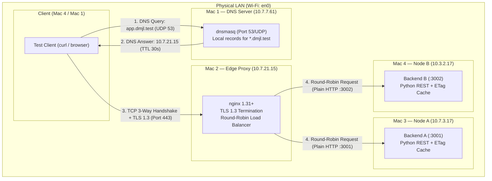
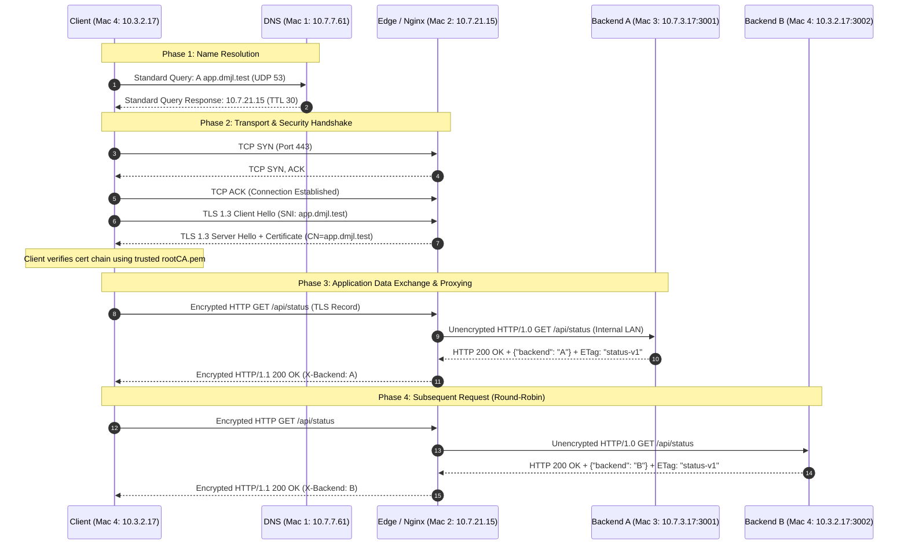

# dmjl_port — Computer Networks Project (Phase 1: Build & Observe)

A private, distributed network platform built across **4 physical MacBook Pros on one LAN** (Submission Type 1). 

A client resolves `app.dmjl.test` through our private local DNS server, establishes an encrypted TLS 1.3 session with our edge reverse proxy, and is dynamically load-balanced across two independent application backends.

> *"The application stays simple — the network is the project."*

---

## 📑 Phase 1 Deliverables Index

All deliverables specified in **Section 9** and **Section 6** of the Course Project specification are documented and linked below:

| Deliverable (Section 9) | Repository Path | Description |
|---|---|---|
| **Architecture Document** | [`ARCHITECTURE.md`](ARCHITECTURE.md) | Network topology, IP/service inventory, request sequence diagram, multi-layer OSI/TCP-IP mappings, and cloud comparisons. |
| **Configuration Bundle** | [`docs/CONFIGURATION_BUNDLE.md`](docs/CONFIGURATION_BUNDLE.md) | Deployed configs (`dnsmasq`, `nginx`), TLS certificate authority setup notes, launch scripts, and runtime commands. |
| **Backend Source Code** | [`backend/server.py`](backend/server.py) | Complete Python REST application (supports Node A `:3001` and Node B `:3002`), `X-Backend`, `Cache-Control`, `ETag`, and `304 Not Modified`. |
| **Evidence Folder** | [`evidence/README.md`](evidence/README.md) | Complete multi-node evidence index mapping to the official submission form fields (DNS, TLS, Wireshark, caching, pings). |
| **Failure Scenarios Analysis** | [`docs/FAILURE_ANALYSIS.md`](docs/FAILURE_ANALYSIS.md) | Exhaustive analysis of all 5 mandatory failure scenarios from Section 6.3 with layer isolation diagnostics. |
| **Course Topic Mapping** | [`docs/COURSE_TOPIC_MAPPING.md`](docs/COURSE_TOPIC_MAPPING.md) | Direct mapping of Section 6.1 lecture topics (TCP/IP, routing, transport ports, TLS, caching) to implementation code. |
| **Evaluation Checklist** | [`docs/EVALUATION_CHECKLIST.md`](docs/EVALUATION_CHECKLIST.md) | 11-step demonstration walkthrough (Section 8) and 50-mark Review 1 rubric alignment. |

---

## 👥 Engineering Team · Section C

| Machine | Role | Name | GitHub Handle | Responsibility |
|---|---|---|---|---|
| **Mac 1** | **Private DNS & Project Lead** | **Dhanvin Vadlamudi** | [@Dhanvin1520](https://github.com/Dhanvin1520) | Private DNS server (`dnsmasq`), LAN routing, repository maintainer |
| **Mac 2** | **Edge & TLS Proxy** | **Jagruthi Pulumati** | [@Jag2007](https://github.com/Jag2007) | Edge reverse proxy (`nginx`), TLS 1.3 termination, Root CA issuance, video lead |
| **Mac 3** | **Application Node A** | **Chaitanya Sai Meka** | [@ChaitanyaSai-Meka](https://github.com/ChaitanyaSai-Meka) | Backend A instance (`:3001`), Wireshark deep packet inspection (DPI) & captures |
| **Mac 4** | **Application Node B & Test Client** | **Kasula Lalithendra** | [@Lalith0024](https://github.com/Lalith0024) | Backend B instance (`:3002`), primary client test suite, telemetry & failover evidence |

---

## 🚀 How to Run the Backends

Python 3 standard library only (zero external package dependencies):

```bash
# Mac 3 (Node A):
python3 backend/server.py A 3001

# Mac 4 (Node B):
python3 backend/server.py B 3002
```

Both backend instances bind to `0.0.0.0`. Supported endpoints:
- `GET /` — Base service identification.
- `GET /api/status` — JSON status payload returning `X-Backend` header and HTTP caching headers (`ETag: "status-v1"`, `Cache-Control: public, max-age=60`).

---

## 🌐 Physical Network Topology

All four nodes operate on the local college LAN with strict LAN IP assignments. No external domains or cloud intermediaries are utilized.

| Node | Physical LAN IP | Interface | Port / Protocol | Service | Cloud Architecture Equivalent |
|---|---|---|---|---|---|
| **Mac 1** | `10.7.7.61` | `en0` | `53/UDP` | `dnsmasq` (Private DNS) | AWS Route 53 Private Hosted Zone |
| **Mac 2** | `10.7.21.15` | `en0` | `443/TCP` (TLS)<br/>`80/TCP` (301 Redirect) | `nginx` (Edge Reverse Proxy & Load Balancer) | AWS Application Load Balancer (ALB) |
| **Mac 3** | `10.7.3.17` | `en0` | `3001/TCP` (HTTP) | Backend Service Replica A (Python) | Amazon EC2 Target Group Instance A |
| **Mac 4** | `10.3.2.17` | `en0` | `3002/TCP` (HTTP) | Backend Service Replica B (Python) + Test Client | Amazon EC2 Target Group Instance B |

**Private Namespace:** `app.dmjl.test` and `api.dmjl.test` (RFC 2606 reserved `.test` TLD) resolve strictly to Mac 2 (`10.7.21.15`).



---

## 🔄 End-to-End Request Lifecycle



---

## 📊 Protocol & OSI Layer Mapping

| Layer (TCP/IP) | OSI Model | Protocol Employed | Platform Component | Concrete Evidence |
|---|---|---|---|---|
| **Application** | Layer 7 | DNS (`RFC 1035`) | `dnsmasq` on Mac 1 | [`A3_dig_client.txt`](evidence/ev_mac4/A3_dig_client.txt), [`C1_dns.png`](evidence/ev_mac3/C1_dns.png) |
| **Application** | Layer 7 | HTTP/1.1 & HTTP/1.0 | REST Backends & Nginx | [`B2_lb_6x.txt`](evidence/ev_mac4/B2_lb_6x.txt), [`D1_headers.txt`](evidence/ev_mac4/D1_headers.txt) |
| **Presentation** | Layer 6 | TLS 1.3 (`RFC 8446`) | Nginx SSL Module | [`B1_curl_v.txt`](evidence/ev_mac4/B1_curl_v.txt), [`C3_tls.png`](evidence/ev_mac3/C3_tls.png), [`C3_cert.png`](evidence/ev_mac3/C3_cert.png) |
| **Transport** | Layer 4 | UDP (Port 53), TCP (443, 3001, 3002) | Socket Layer | [`C2_tcp.png`](evidence/ev_mac3/C2_tcp.png), [`C_bonus_http.png`](evidence/ev_mac3/C_bonus_http.png) |
| **Network** | Layer 3 | IPv4 Routing & ICMP | LAN Subnets (`10.7.x.x` / `10.3.x.x`) | [`A5_pings_mac1.txt`](evidence/ev_mac1/A5_pings_mac1.txt), [`A5_pings_mac2.txt`](evidence/ev_mac2/A5_pings_mac2.txt) |
| **Data Link / Physical** | Layers 1–2 | IEEE 802.11 Wi-Fi (`en0`) | Hardware Interfaces | [`A1_mac1.txt`](evidence/ev_mac1/A1_mac1.txt) to [`A1_mac4.txt`](evidence/ev_mac4/A1_mac4.txt) |

---

## 🌟 Bonus Implementation: Visual Proof of TLS Termination

In production microservice architectures (e.g. AWS ALB to EC2), ingress traffic from clients across the WAN/LAN is secured with TLS, while internal communications between the load balancer and backend workers are offloaded to high-performance cleartext HTTP.

Our capture in [`C_bonus_http.png`](evidence/ev_mac3/C_bonus_http.png) definitively demonstrates this:
1. **Client to Edge (Mac 4 ➔ Mac 2):** Encrypted TLS 1.3 payload over port 443 (captured in `C3_tls.png`).
2. **Edge to Backend (Mac 2 ➔ Mac 3):** Clean, unencrypted HTTP GET request over port 3001 captured live on Mac 3's Wi-Fi interface.

---

## 🛡️ High Availability & Automatic Failover (Option A)

Our edge proxy is configured with active error interception and passive health check policies (`max_fails=1 fail_timeout=10s`):
- **Normal State:** Requests cycle evenly: `A -> B -> A -> B -> A -> B` ([`D3_before.txt`](evidence/ev_mac4/D3_before.txt)).
- **Fault Injected:** Backend A process is killed (`Ctrl+C` on Mac 3). 
- **Network Resilience:** DNS resolution and ICMP pings to Mac 3 remain unaffected ([`D3_layers.txt`](evidence/ev_mac4/D3_layers.txt)).
- **Automatic Failover:** When Nginx encounters a connection refusal on port 3001, it instantaneously retries the idempotent request against Backend B within the same client transaction. The client experiences **zero connection errors**, and 100% of requests successfully return HTTP 200 via Backend B ([`D3_after.txt`](evidence/ev_mac4/D3_after.txt)).
- **Restoration:** Once Backend A is brought back online, Nginx automatically rejoins it to the pool after the timeout period ([`D3_restored.txt`](evidence/ev_mac4/D3_restored.txt)).

---

## 📁 Repository & Evidence Index

All project evidence collected during the live multi-node session is archived in [`evidence/`](evidence/README.md):

```
evidence/
├── README.md                      # Comprehensive form-to-evidence mapping table
├── ev_mac1/                       # Node 1: Dhanvin Vadlamudi (DNS Authority)
│   ├── A1_mac1.txt                # Interface & IP configuration
│   ├── A2_dnsmasq.txt             # Active dnsmasq runtime configuration
│   ├── A5_pings_mac1.txt          # ICMP reachability verification (0.0% loss)
│   └── dnsmasq.conf               # Deployed configuration file
├── ev_mac2/                       # Node 2: Jagruthi Pulumati (Edge Proxy & TLS)
│   ├── A1_mac2.txt                # Interface & IP configuration
│   ├── A5_pings_mac2.txt          # ICMP reachability verification (0.0% loss)
│   └── B3_nginx.conf              # Upstream load balancing & TLS configuration
├── ev_mac3/                       # Node 3: Chaitanya Sai Meka (Backend A & Wireshark)
│   ├── A1_mac3.txt                # Interface & IP configuration
│   ├── A5_pings_mac3.txt          # ICMP reachability verification (0.0% loss)
│   ├── dmjl_phase1_capture.pcapng # Full live raw packet capture
│   ├── C1_dns.png                 # Wireshark DNS query/response trace
│   ├── C2_tcp.png                 # Wireshark TCP 3-way handshake (SYN, SYN-ACK, ACK)
│   ├── C3_tls.png                 # Wireshark TLS Client/Server Hello & Cipher Suites
│   ├── C3_cert.png                # Wireshark TLS Certificate packet inspection
│   └── C_bonus_http.png           # BONUS: Plaintext HTTP trace between edge & backend
└── ev_mac4/                       # Node 4: Kasula Lalithendra (Backend B & Client)
    ├── A1_mac4.txt                # Interface & IP configuration
    ├── A3_dig_client.txt          # Resolution of app.dmjl.test via Mac 1
    ├── A4_dig_8888.txt            # Proof of private domain isolation (NXDOMAIN @8.8.8.8)
    ├── B1_curl_v.txt              # Verbose TLS handshake verification (no -k flag)
    ├── B2_lb_6x.txt               # 6x round-robin alternating response trace
    ├── D1_headers.txt             # RFC 9111 Cache-Control and ETag headers
    ├── D1_304.txt                 # RFC 9110 HTTP 304 Not Modified revalidation
    ├── D3_before.txt              # Pre-failure load balancing state
    ├── D3_layers.txt              # Verification of DNS & IP layers during backend fault
    ├── D3_after.txt               # Post-failure 100% failover to Backend B
    └── D3_restored.txt            # Post-restoration recovery trace
wireshark/                         # Dedicated Wireshark DPI Gallery
├── README.md                      # Comprehensive DPI guide & visual screenshot gallery
├── dmjl_phase1_capture.pcapng     # Full live raw packet capture
├── C1_dns.png                     # Wireshark DNS query/response trace
├── C2_tcp.png                     # Wireshark TCP 3-way handshake (SYN, SYN-ACK, ACK)
├── C3_tls.png                     # Wireshark TLS Client/Server Hello & Cipher Suites
├── C3_cert.png                    # Wireshark TLS Certificate packet inspection
└── C_bonus_http.png               # BONUS: Plaintext HTTP trace between edge & backend
```

---

## 🛠️ Verification & Reproduction Commands

Clone this repository:
```bash
git clone https://github.com/Dhanvin1520/dmjl-port-cn-project.git ~/dmjl
cd ~/dmjl
```

1. **Verify Private DNS:**
   ```bash
   dig @10.7.7.61 app.dmjl.test +short
   # Returns: 10.7.21.15
   ```
2. **Verify Public DNS Isolation:**
   ```bash
   dig @8.8.8.8 app.dmjl.test
   # Returns: NXDOMAIN
   ```
3. **Verify TLS 1.3 Handshake (No `-k` flag):**
   ```bash
   curl -v https://app.dmjl.test/api/status
   # Returns: SSL certificate verify ok, HTTP/1.1 200 OK
   ```
4. **Verify Load Balancing Alternation:**
   ```bash
   for i in {1..6}; do curl -si https://app.dmjl.test/api/status | grep -iE '^HTTP|x-backend'; done
   ```
5. **Verify HTTP 304 Caching:**
   ```bash
   curl -sI -H 'If-None-Match: "status-v1"' https://app.dmjl.test/api/status
   # Returns: HTTP/1.1 304 Not Modified
   ```
