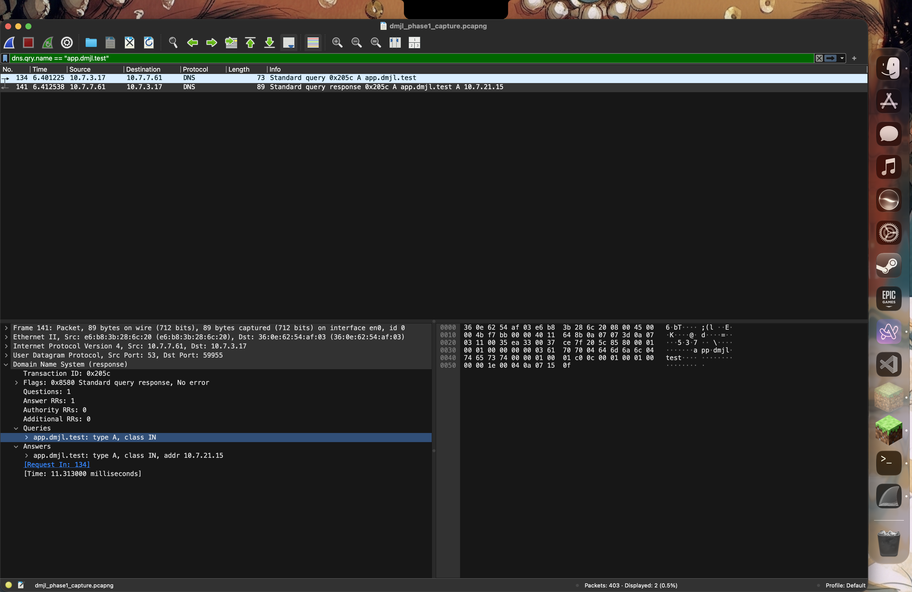
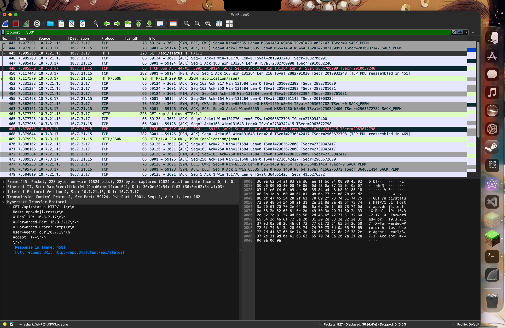

# Phase 1 Submission Evidence Index

All files listed below contain **raw, unedited terminal output and network captures** collected across the 4 physical MacBook Pros during the Phase 1 Build & Observe session.

---

## 📑 Evidence Mapping Table for Google Form

| Form Section & Field | Source Node | Captured Evidence File | Verified Output Summary |
|---|---|---|---|
| **A1 — Machine Roles & Interface Details** | All Nodes | [`ev_mac1/A1_mac1.txt`](ev_mac1/A1_mac1.txt) [`ev_mac2/A1_mac2.txt`](ev_mac2/A1_mac2.txt) [`ev_mac3/A1_mac3.txt`](ev_mac3/A1_mac3.txt) [`ev_mac4/A1_mac4.txt`](ev_mac4/A1_mac4.txt) | Confirms physical IP assignments (`10.7.7.61`, `10.7.21.15`, `10.7.3.17`, `10.3.2.17`), default routes, MAC addresses, and `en0` interface. |
| **A2 — dnsmasq Configuration** | Mac 1 | [`ev_mac1/A2_dnsmasq.txt`](ev_mac1/A2_dnsmasq.txt) (Full config: [`ev_mac1/dnsmasq.conf`](ev_mac1/dnsmasq.conf)) | Local A-record mapping for `app.dmjl.test` and `api.dmjl.test` pointing to `10.7.21.15` with TTL 30s and upstream forwarding. |
| **A3 — DNS Resolution from Client** | Mac 4 | [`ev_mac4/A3_dig_client.txt`](ev_mac4/A3_dig_client.txt) | Standard `dig app.dmjl.test` showing `status: NOERROR`, `ANSWER: 10.7.21.15`, and `SERVER: 10.7.7.61#53`. |
| **A4 — Private Domain Isolation** | Mac 4 | [`ev_mac4/A4_dig_8888.txt`](ev_mac4/A4_dig_8888.txt) | `dig @8.8.8.8 app.dmjl.test` returning `NXDOMAIN`, proving `.test` is purely private and isolated from public DNS. |
| **A5 — Full Mesh ICMP Ping Reachability** | All Nodes | [`ev_mac1/A5_pings_mac1.txt`](ev_mac1/A5_pings_mac1.txt) [`ev_mac2/A5_pings_mac2.txt`](ev_mac2/A5_pings_mac2.txt) [`ev_mac3/A5_pings_mac3.txt`](ev_mac3/A5_pings_mac3.txt) | 6 pairwise ping audits confirming bidirectional IP connectivity with **0.0% packet loss**. |
| **B1 — Verbose HTTPS / TLS Verification** | Mac 4 | [`ev_mac4/B1_curl_v.txt`](ev_mac4/B1_curl_v.txt) | `curl -v https://app.dmjl.test` showing TLS 1.3 handshake, `CN=app.dmjl.test`, `issuer: CN=dmjl_port Local CA`, SSL verify OK (no `-k`), and HTTP 200. |
| **B2 — Round-Robin Load Balancing** | Mac 4 | [`ev_mac4/B2_lb_6x.txt`](ev_mac4/B2_lb_6x.txt) | 6 consecutive curl requests demonstrating deterministic alternating load distribution (`X-Backend: A` and `X-Backend: B`). |
| **B3 — Nginx Edge Configuration** | Mac 2 | [`ev_mac2/B3_nginx.conf`](ev_mac2/B3_nginx.conf) | Upstream backend pool definition, TLS 1.3 certificate directives, proxy headers, and HTTP 80-to-443 redirect. |
| **C1 — Wireshark DNS Query & Response** | Mac 3 | [`ev_mac3/C1_dns.png`](ev_mac3/C1_dns.png) | Wireshark filter `dns.qry.name == "app.dmjl.test"` displaying UDP query and response with Transaction ID, flags, and answer IP. |
| **C2 — Wireshark TCP 3-Way Handshake** | Mac 3 | [`ev_mac3/C2_tcp.png`](ev_mac3/C2_tcp.png) | Wireshark filter `ip.addr == 10.7.21.15 && tcp.port == 443` showing sequence of `[SYN]`, `[SYN, ACK]`, and `[ACK]`. |
| **C3 — Wireshark TLS Handshake & Cipher Suites** | Mac 3 | [`ev_mac3/C3_tls.png`](ev_mac3/C3_tls.png) [`ev_mac3/C3_cert.png`](ev_mac3/C3_cert.png) | Client Hello cipher suite negotiation, Server Hello chosen parameters, and Certificate packet details (`CN=app.dmjl.test`). |
| **C_Bonus — Wireshark TLS Offloading Trace** | Mac 3 | [`ev_mac3/C_bonus_http.png`](ev_mac3/C_bonus_http.png) | **BONUS EVIDENCE:** Wireshark inspection on port 3001 proving edge-to-backend communication is unencrypted HTTP, verifying reverse-proxy TLS termination. |
| **C — Full Raw Packet Capture** | Mac 3 | [`ev_mac3/dmjl_phase1_capture.pcapng`](ev_mac3/dmjl_phase1_capture.pcapng) | Complete pcapng file of all captured traffic during test execution. |
| **D1 — Caching Headers & Revalidation** | Mac 4 | [`ev_mac4/D1_headers.txt`](ev_mac4/D1_headers.txt) [`ev_mac4/D1_304.txt`](ev_mac4/D1_304.txt) | Verification of RFC 9111 `Cache-Control: public, max-age=60`, RFC 9110 `ETag: "status-v1"`, and HTTP 304 Not Modified response upon `If-None-Match`. |
| **D3 — High Availability & Failure Demo** | Mac 4 | [`ev_mac4/D3_before.txt`](ev_mac4/D3_before.txt) [`ev_mac4/D3_layers.txt`](ev_mac4/D3_layers.txt) [`ev_mac4/D3_after.txt`](ev_mac4/D3_after.txt) [`ev_mac4/D3_restored.txt`](ev_mac4/D3_restored.txt) | Demonstrates graceful failover: Backend A shutdown causes automatic 100% traffic reroute to Backend B without client errors, followed by full recovery upon restart. |

---

## 📸 Wireshark Packet Inspection Gallery

### 1. C1: DNS Query & Response (`dns.qry.name == "app.dmjl.test"`)
Shows the UDP query (Frame 134) from client (`10.7.3.17:59955`) to DNS server (`10.7.7.61:53`) and A-record response with the AA flag set (Frame 141) pointing to `10.7.21.15` (Transaction ID `0x205c`, TTL 30s).

---

### 2. C2: TCP 3-Way Handshake (`ip.addr == 10.7.21.15 && tcp.port == 443`)
Shows the `[SYN]` (Frame 143), `[SYN, ACK]` (Frame 146), and `[ACK]` (Frame 147) packet exchange on socket pair (`10.7.3.17:62924 <-> 10.7.21.15:443`), establishing connection-oriented transport.

---

### 3. C3: TLS Handshake & Cipher Suites (`ip.addr == 10.7.21.15 && tls`)
Shows Client Hello (Frame 148) advertising cipher suites and Server Hello (Frame 151) establishing TLS 1.3 encryption with `TLS_CHACHA20_POLY1305_SHA256`.

---

### 4. C3 (Cert): Certificate Packet Inspection
Under TLS 1.2 negotiation (Frame 193), inspects the X.509 certificate payload presenting `CN=app.dmjl.test` issued by `CN=dmjl_port Local CA`.

---

### 5. 🌟 Bonus Proof: Cleartext HTTP Trace (TLS Offloading on Edge)
Demonstrates plain HTTP GET request from Mac 2 (Edge) to Mac 3 (Backend A) on port 3001, proving reverse proxy TLS termination.

---

> 📖 **Comprehensive Failure Scenarios Analysis:**  
> For an in-depth diagnostic breakdown of all 5 mandatory failure scenarios specified in Section 6.3 of the Course Project specification, see [**`docs/FAILURE_ANALYSIS.md`**](../docs/FAILURE_ANALYSIS.md).
