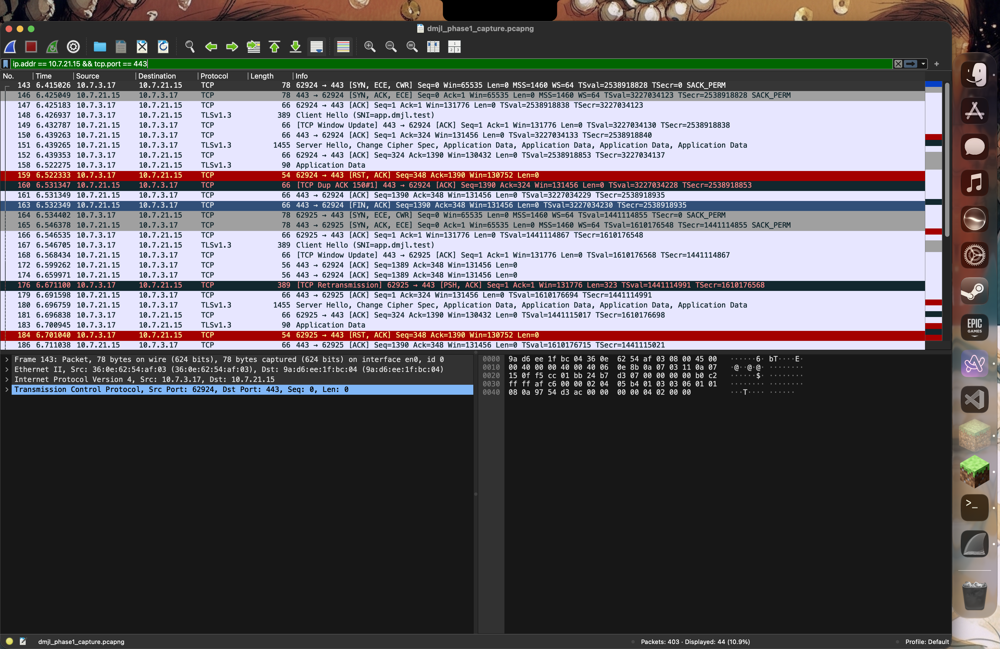
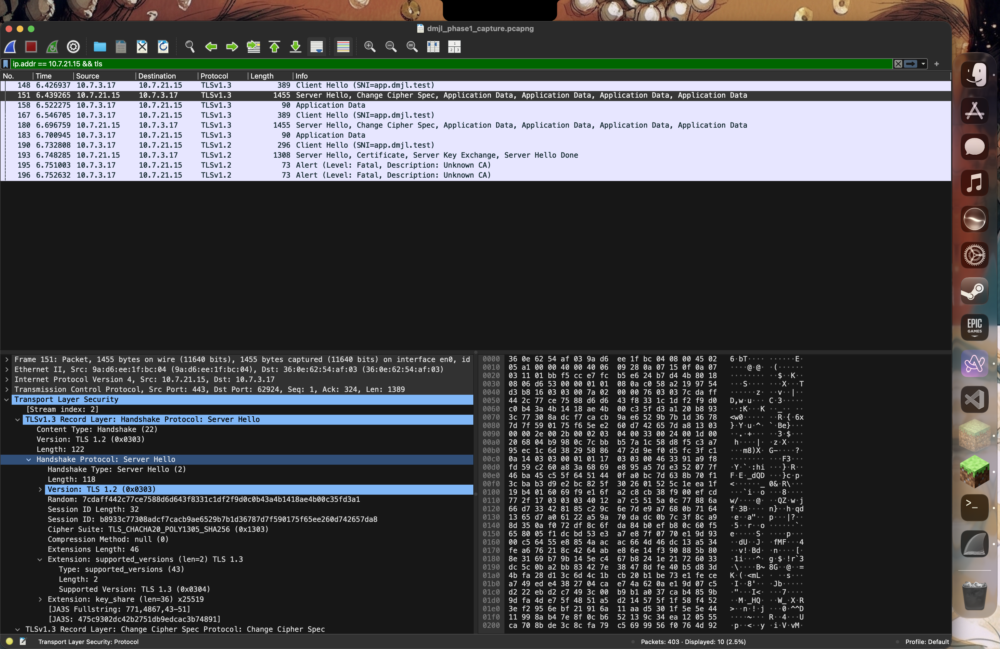
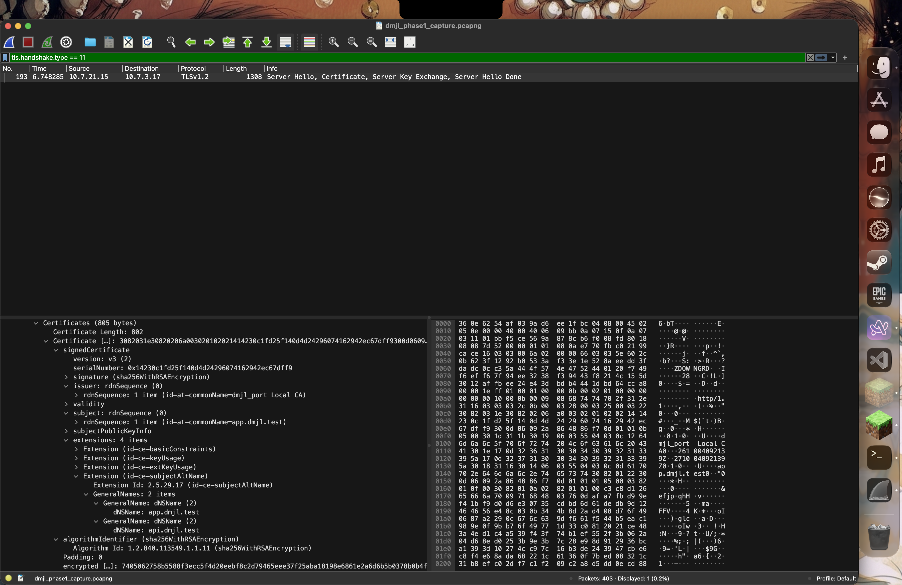

# Wireshark Deep Packet Inspection (DPI) & Protocol Traces

> **Capture Node:** Mac 3 (`10.7.3.17`)  
> **Interface:** `en0` (Physical Wi-Fi LAN)  
> **Trace File:** [`dmjl_phase1_capture.pcapng`](dmjl_phase1_capture.pcapng)  
> **Capture Lead:** Chaitanya Sai Meka ([@ChaitanyaSai-Meka](https://github.com/ChaitanyaSai-Meka))  

---

## 📑 Packet Capture Inventory

| Artifact | Wireshark Display Filter | Protocol Layer | Description |
|---|---|---|---|
| [`C1_dns.png`](C1_dns.png) | `dns.qry.name == "app.dmjl.test"` | Application (UDP 53) | Private DNS query and authoritative A-record answer pointing to `10.7.21.15`. |
| [`C2_tcp.png`](C2_tcp.png) | `ip.addr == 10.7.21.15 && tcp.port == 443` | Transport (TCP 443) | Standard 3-way handshake (`[SYN]`, `[SYN, ACK]`, `[ACK]`) before TLS negotiation. |
| [`C3_tls.png`](C3_tls.png) | `ip.addr == 10.7.21.15 && tls` | Presentation (TLS 1.3) | Client Hello cipher suites and Server Hello handshake establishment. |
| [`C3_cert.png`](C3_cert.png) | `tls.handshake.type == 11` | Security (X.509) | Server certificate payload presenting `CN=app.dmjl.test` issued by local CA. |
| [`C_bonus_http.png`](C_bonus_http.png) | `http && tcp.port == 3001` | Application (HTTP/1.0) | **🌟 BONUS PROOF:** Unencrypted HTTP traffic from Edge to Backend, proving TLS termination. |

---

## 📸 Visual Inspection Gallery

### 1. DNS Query & Response (`C1_dns.png`)
- **Query (Frame 134):** Client `10.7.3.17:59955` sends UDP query for `app.dmjl.test` to private resolver `10.7.7.61:53` (Transaction ID `0x205c`).
- **Answer (Frame 141):** Resolver returns `10.7.21.15` with TTL 30s (`Flags: 0x8580` Standard query response, Authoritative Answer, No error).

---

### 2. TCP 3-Way Handshake (`C2_tcp.png`)
- **SYN (Frame 143):** Client (`10.7.3.17:62924`) sends `[SYN]` to Edge (`10.7.21.15:443`) with Seq=0.
- **SYN-ACK (Frame 146):** Edge responds with `[SYN, ACK]` (Seq=0, Ack=1).
- **ACK (Frame 147):** Client confirms with `[ACK]` (Seq=1, Ack=1).
- **Outcome:** Reliable, ordered, connection-oriented channel established before any application data is sent.

---

### 3. TLS Handshake & Cipher Negotiation (`C3_tls.png`)
- **Client Hello (Frame 148):** Client offers `supported_versions` TLS 1.3/1.2/1.1/1.0, SNI (`app.dmjl.test`), and 49 cipher suites (incl. `0x00ff` SCSV).
- **Server Hello (Frame 151):** Edge selects `TLS_CHACHA20_POLY1305_SHA256` (`0x1303`) under TLS 1.3. The same segment carries ChangeCipherSpec (middlebox compatibility, RFC 8446) and four encrypted records of 70, 832, 281 and 53 bytes: EncryptedExtensions, Certificate, CertificateVerify and Finished. Each is the plaintext size seen in `curl -v` (53, 815, 264, 36 bytes) plus 17 bytes of AEAD overhead, so in TLS 1.3 the certificate itself is encrypted.
- **Confidentiality:** In TLS 1.3, all subsequent handshake records and application payload (HTTP GET, headers, JSON body) are encapsulated in encrypted Application Data records (content type 23).

---

### 4. TLS Certificate Payload (`C3_cert.png`)
- **Certificate Inspection (Frame 193):** Under a TLS 1.2 negotiation (`tls.handshake.type == 11`), the server delivers the cleartext X.509 certificate payload presenting `CN=app.dmjl.test` and signed by `CN=dmjl_port Local CA`.

---

### 5. 🌟 Bonus Trace: Reverse Proxy TLS Offloading (`C_bonus_http.png`)
- **Architecture Validation:** Demonstrates that while client-to-edge traffic is encrypted with TLS 1.3 on port 443, traffic between Nginx (`10.7.21.15`) and Backend A (`10.7.3.17:3001`) is clean, unencrypted HTTP GET traffic.
- **Source:** This screenshot comes from a separate capture; `dmjl_phase1_capture.pcapng` contains no plaintext HTTP.
- **Proof:** Confirms that TLS terminates strictly at the edge proxy, exactly mirroring enterprise cloud architecture (e.g. AWS ALB to EC2).

